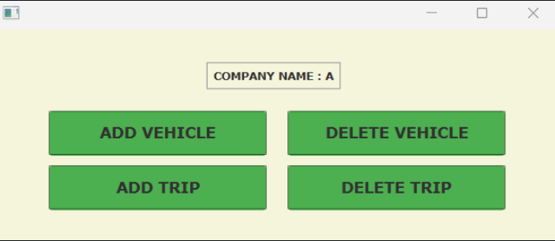
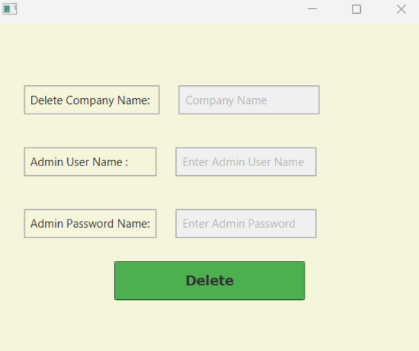

# Ticket_Booking_System
Ticket Reservation System written in Java as a school project

## Purpose
The aim of this project is to learn the basics of object-oriented programming and become able to use it appropriately in a project.

## Screenshots
|                          Company                           |                             Admin                              |
:----------------------------------------------------------:|:--------------------------------------------------------------:
|           |                 | 
|                      Make Reservation                      |                           Show Trips                           |
|  |  |
|                                                            |                                                                |

### Dependencies 
* JavaFX